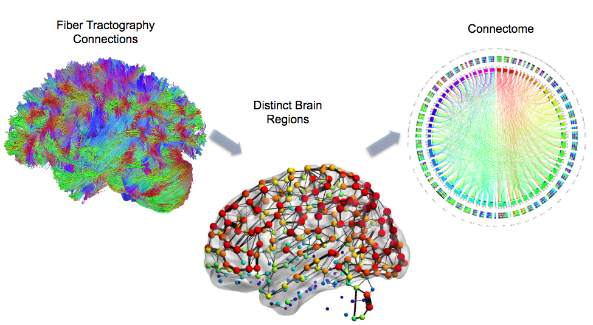
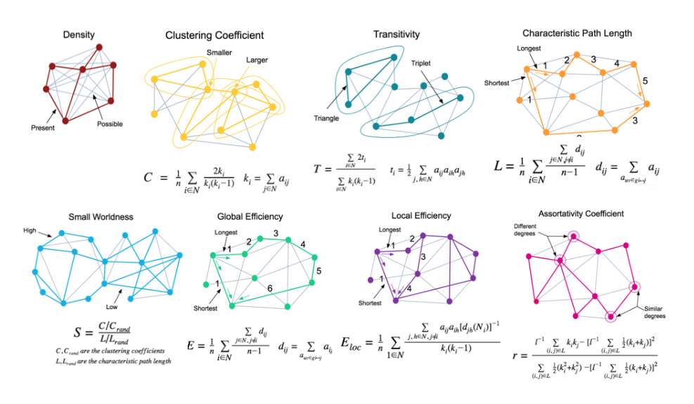

# Data Analysis Repository 
Github Data Analysis Repository by Cristina Bañuelos

### How structural brain network topologies associate with cognitive abilities in a value-based decision task

## Background

 The brain is a highly organized network consisting of approximately 86 billion interconnected neurons (Herculano-Houzel, 2009). There are input-output computations made across all regions of the brain that are connected by bundles of axon fibers that communicate across long distances (Hopfield, 1982; Mountcastle, 1997). Fast and efficient communication throughout the brain is necessary for nearly all cognitive processes. This highly complex network is organized through cell bodies, dendrites, and axon terminals of these neurons that, together, make up the “grey matter”, whereas the axons connecting the cell bodies to the axon terminals make up the “white matter”. From a graph perspective, grey matter are the nodes that process information, and white matter forms the edges that determine which information is sent between nodes. The exact nature of the wiring architecture of the human brain, much like a circuit in a computer, impacts brain function, leading to subsequent cognition (McCulloch, 1944; Johansen-Berg, 2010; Hermundstad et al., 2014). The static organization of the structural architecture of the brain is both modular and hierarchical, supporting executing local operations and global integration of segregated functions (Park & Friston, 2013). Being able to measure the individual differences in structural connectivity of brain networks and their subsequent behavior would allow for the ability to explain the neural constraints on complex cognition (Verstynen, 2015). 

   The structural connectivity of brain networks is measured through a technique known as diffusion-weighted imaging (DWI). DWI takes advantage of the diffusion properties of water molecules within the axons of the myelinated white matter fascicles. Diffusion tensor imaging is one of the most popular DWI sampling schemes, sampling a few dozen orthogonal diffusion directions that are used to calculate a tensor of average diffusion direction within each voxel (for review, see Vettel et al., 2017). DWI has been used in conjunction with graph theoretic structural topology measures in order to understand the functional organization underlying structural networks (for review see Bullmore & Sporns, 2009). 
There is growing evidence that brain networks have small-worldness properties, that can be characterized as a dense local clustering between neighboring nodes forming modules paired with short path length between any pairs between modules (Watts & Strogatz, 1998). This small-worldness supports the distributed nature of distinct brain areas while also demonstrating how these modules are integrated into global brain networks (Bassett & Bullmore 2006). However, we still have a limited understanding on how the topological organization of structural connections in the brain predicts individual differences in complex cognitive abilities. 

   In order to gain insights into how the brain may be organized to carry out executive processes, we looked into how the structural network organization may explain differences in executive abilities that are  necessary to complete complex cognitive tasks. Using DWI methods, we measured whether individual differences in white matter topology, as seen through graph theoretic measures, associate with value-based decision-making (payoff or sensitivity to frequency of reward) (Figure 1; Figure 2). Value-based decision-making is a complex task that, at a minimum, uses visual perception, attention, working memory, reinforcement learning, executive control, and other lower order functions in order to synthesize our decisions, and therefore relies on the efficient communication across global brain networks (Bechara et al., 1994). If small-worldness is a property of efficient network communication, then we hypothesize that individuals with more small world structural networks would be better at feedback driven, value-based decision-making.

### Figure 1: Brain Network Connectome
 

### Figure 2: Computerized version of the Iowa Gambling Task
 

---

### Variables of Interest

**Subject ID:** Lab_ID

**Demographic Measures:**
 - **Sex:** (Sex) As reported by participants (options: male or female)
 - **Age:** (Age) As collected by the experimenters (in years)

**Binary and Baseline Structural Topology Measures (Figure 3):**
 - **Density:** (density_baseline) the fraction of present connections to all possible connections without taking into account any connection weights in the calculation (Rubinov & Sporns 2010)
 - **Clustering Coefficient Average**: (clustering_coeff_average.binary._baseline)
 - **Transitivity:** (transitivity.binary._baseline) the ratio of triangles to triplets in the network, and can be used as an alternative measure to the clustering coefficient (Rubinov & Sporns 2010), although these are not identical metrics
 - **Network Characteristic Path Length:** (network_characteristic_path_length.binary._baseline) the average shortest path length in the network (Rubinov & Sporns)
 - **Small Worldness:** (small.worldness.binary._baseline) dense local clustering or cliquishness of connections between neighboring nodes yet a short path length between any (distant) pair of nodes due to the existence of relatively few long range connections (Bassett & Bullmore 2006)
 - **Global Efficiency:** (global_efficiency.binary._baseline) the average inverse shortest path length in the network (Rubinov & Sporns 2010)
 - **Local Efficiency:** (local_efficiency.binary._baseline) the global efficiency computed on node neighborhoods, and is related to the clustering coefficient (Rubinov & Sporns 2010)
 - **Assortativity Coefficient:** (assortativity_coefficient.binary._baseline) a correlation coefficient between the degrees of all nodes on two opposite ends of a link (Rubinov & Sporns). A positive value would indicate that nodes tend to link to other nodes with the same or a similar degree (Rubinov & Sporns 2010)

### Figure 3: Graphed Structural Topology Measures
 

**Baseline IGT Measures (Figure 4)**
 - **Payoff (P):** (baseline_p) difference between the participant’s total selections from the “advantageous” decks minus the “disadvantageous” decks
 
$$ P = (C+D) - (A+B) $$
 
  
 
 - **Sensitivity to Frequency of Reward (Q):** (baseline_q) difference between the participant’s total selections from decks with a high reward frequency minus the decks with a low reward frequency
 
$$ Q = (B+D) - (A+C)$$
 
 ### Figure 4: Iowa Gambling Task Desk Specifications
 

---
### Hypothesis

We hypothesize that individual differences in brain network topology predict differences in a complex value-based decision task.

---
### Data Analysis Organization
 * Data Cleansing (Step by step):
    * Data Auditing
    * Workflow Specification
    * Workflow Execution & Post-procesing Control
 * Description of Data Architecture
 * Statistical Analyses (Step by step):
    * Distribution Analysis
    * Correlation Matrices 
    * Principal Component Analyses 
    * Generalized Linear Model
    * Cross-Validation Analysis
    * Bootstrapping
    * Bayes Factor Analysis
    
    
---

### Conclusions

Here we tested the hypothesis that individuals with a more small-world structural brain networks would be better at feedback driven, value-based decision-making. First we found that the graph topology measures of white matter networks had a low dimensional structure that could be mostly explained by five principal components. A regression analysis examining how these components correlated with the ability to use feedback to maximize long term payoffs (P) and the sensitivity to high frequency rewards (Q) did not find an association with the former, but did with the latter. One component, mapping heavily on density, transitivity, global efficiency, and assortativity topology measures, reliably associated with sensitivity to rewards, such that these structural network properties may predict greater sensitivity.